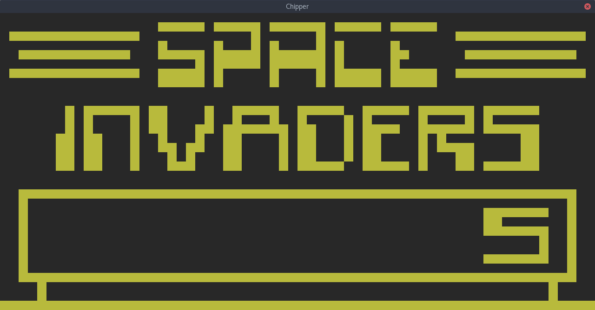

# Chipper

CHIP-8 Emulator/Interpreter

 > CHIP-8 is an interpreted programming language, developed by Joseph Weisbecker. It was initially used on the COSMAC VIP and Telmac 1800 8-bit microcomputers in the mid-1970s. CHIP-8 programs are run on a CHIP-8 virtual machine. It was made to allow video games to be more easily programmed for said computers.



## Building
Requires SDL2 to be installed
```
sudo apt-get install libsdl2-dev
```

Build
```
cargo build --release
```

## Running
There are 23 public domain roms available in roms directory.

To load a *PONG2* game, run:
```
cargo run --release -- roms/PONG2
```

## References
Links I've used to create this project

 - [CHIP-8 - Wikipedia](https://en.wikipedia.org/wiki/CHIP-8)
 - [Cowgod's Chip-8 Technical Reference](http://devernay.free.fr/hacks/chip8/C8TECH10.HTM)
 - [Guide used - How to write an emulator (CHIP-8 interpreter)](http://www.multigesture.net/articles/how-to-write-an-emulator-chip-8-interpreter/)
